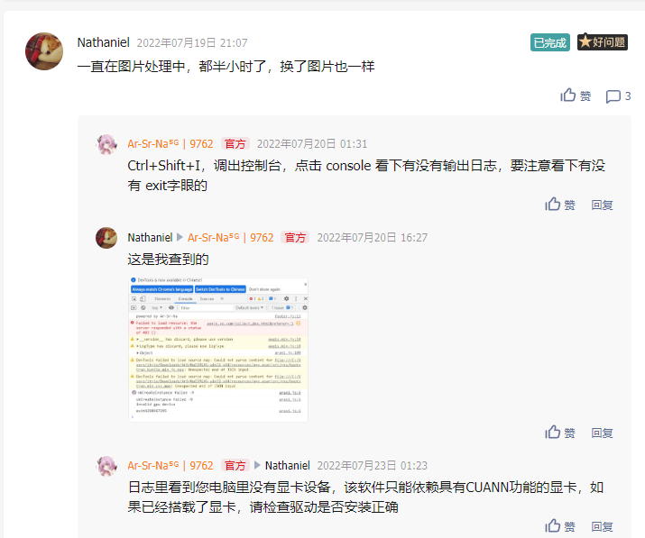

# ArSrNaUI ESRGAN图像超分辨率软件

## 构建本软件

平台：node v18.13.0 ；npm v8.19.3

### clone源代码

````shell
git clone https://github.com/ArSrNa/ArESRGAN-GUI.git
````

安装依赖

````shell
cd ArESRGAN-GUI
npm i
````

*中国大陆用户注意：由于dddd的原因，安装过程不一定顺利，因为electron某些依赖使用镜像会报错，所以建议不要换镜像下载，使用npm默认镜像即可*

安装完成后即可启动

````shell
npm run start
````

## 源代码内容

| 目录      | 内容         |
| --------- | ------------ |
| ./src     | 主应用资源   |
| ./backres | 依赖平台文件 |

./src目录内容如下

| 文件       | 内容       |
| ---------- | ---------- |
| js/        | 前端代码   |
| res/       | 前端依赖   |
| index.css  | 前端样式   |
| index.html | 前端结构   |
| index.js   | 后端主应用 |

## 实现方式与原理

### 前后端通讯

前端通过websocket消息，与后端实时交流，因后续开发联机功能的处理，故使用websocket通信而不是原生方式。

前端方式如下

````js
var ws = new WebSocket(`ws://localhost:${port}/esrgan`);
ws.send('我永远喜欢菲谢尔')
ws.onmessage=(msg)=>{
    // 接收后端信息
    // msg.data 即为后端消息
}
````

后端使用express与express-ws处理前端请求
后端处理如下

````js
app.ws('/esrgan',(ws,req)=>{
    ws.on('message',(msg)=>{
        //消息callback
    })
})
````

### Child_Process

node中有这么一个模块，可以调用子进程，通过这个方式实现调用编译后的ESRGAN

````js
var spawn = require('child_process').spawn;

esrgan = spawn(esrganPath,[
    '-i',file,
    '-o',`${file}_optimization.png`,
    '-n',model
  ]); 
````

简单地封装起来

````js
function optimization(ws,data){
  var file = data.file;
  var model = data.model;
  esrgan = spawn(esrganPath,[
    '-i',file,
    '-o',`${file}_optimization.png`,
    '-n',model
  ]); 
  esrgan.stderr.on('data', function (data) { 
    console.log(data.toString('utf8'));
    var progressSet = parseInt(data)/100
    if(typeof progressSet=='number') mainWindow.setProgressBar(progressSet)
    ws.send(JSON.stringify({
      type:'log',
      data:data.toString('utf8')
    }));
    //return data;
    }); 
    esrgan.on('exit', function (code, signal) { 
    mainWindow.setProgressBar(-1)
    console.log('child process eixt ,exit:' + code); 
    ws.send(JSON.stringify({
      type:'exit',
      code:'exit'+code
    }));
    return code
    });
  }
````

# 问题反馈

您可以在这个页面的 issues 提交您的疑问，建议附上日志，控制台（Ctrl+Shift+I调出）截图

或者到 https://support.qq.com/product/419220 进行业务层面的反馈

# 当您阅读到此时

这是我第一次做electron的应用，存在无数的不足，现在已经一年了，更新了不下10个版本，因为大家的支持与信任让我们有勇气，有理由继续做下去，虽然核心部分不是我所开发的，但作为“第一次”还是有点纪念意义的

2022-1-26 ~ 2023-2-5

我把这个应用发布在b站的时候，未曾想过有如此多关注度，也从没想过这么多的下载量，以至于连夜买了500G的资源包仍然超量

我们开放了用于反馈的通道，本以为只有自己能发现问题，结果确实大家先发现了许多bug，让这个应用愈发完美。

我们也积极响应所有用户的提问，积极修复问题，几乎在1周内就能实现。





大家给了我灵感，减轻了我排查bug的负担，也因为此，我更有动力继续把应用产品做下去

**在此，我诚挚地感谢所有使用本软件的用户，感谢所有为此软件做出贡献的用户，感谢您的信任与支持**

# 暂时不知道还能写什么了

---

**感谢您的支持**
*Powered by Ar-Sr-Na*
